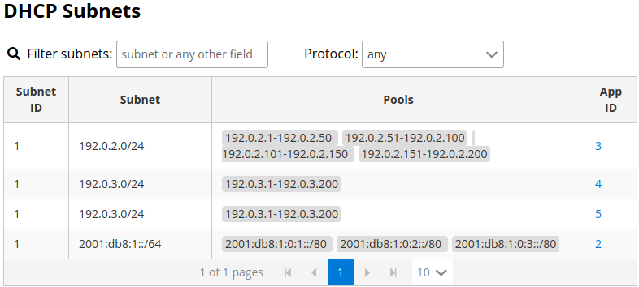
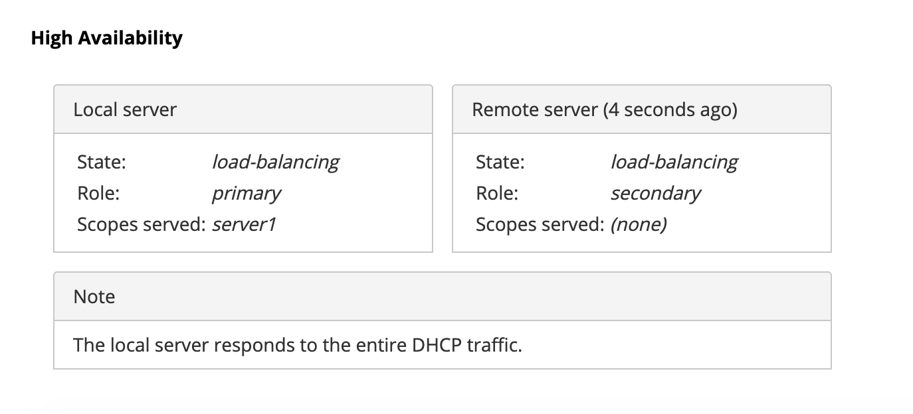

.. _usage:

***********
Using Stork
***********

This section describes how to use the features available in ``Stork``. To
connect to ``Stork``, use a web browser and connect to port 8080. If
Stork is running on a localhost, it can be reached by navigating to
http://localhost:8080.

Managing Users
==============

A default administrator account is created upon initial installation of Stork. It can be used to
sign in to the system via the web UI, using the username ``admin`` and password ``admin``.

To manage users, click on the ``Configuration`` menu and choose ``Users`` to see a list of
existing users. There will be at least one user, ``admin``.

To add a new user, click ``Create User Account``. A new tab opens to
specify the new account parameters. Some fields have specific
restrictions:

- Username can consist of only letters, numbers, and an underscore
  (_).
- The e-mail field is optional, but if specified, it must be a
  well-formed e-mail.
- The firstname and lastname fields are mandatory.
- The password must only contain letters, digits, @, ., !, +, or -,
  and must be at least eight characters long.

Currently, users are associated with one of the two predefined groups
(roles), i.e. ``super-admin`` or ``admin``, which must be selected
when the user account is created.  Users belonging to the
``super-admin`` group are granted full privileges in the system,
including creation and management of user accounts. The ``admin``
group has similar privileges, except that the users in this group are
not allowed to manage other users' accounts.

Once the new user account information has been specified and all
requirements are met, the ``Save`` button becomes active and the new
account can be enabled.

Changing a User Password
========================

An initial password is assigned by the administrator when a user
account is created.  Each user should change the password when first
logging into the system.  To change the password, click on the
``Profile`` menu and choose ``Settings`` to display the user profile
information.  Click on ``Change password`` in the menu bar on the left
and specify the current password in the first input box. The new
password must be specified and confirmed in the second and third input
boxes, and must meet the password requirements specified in the
previous section. When all entered data is valid, the ``Save`` button
is activated for changing the password.

Configuration Settings
======================

It is possible to control some of the Stork configuration settings from
the web UI. Click on the ``Configuration`` menu and choose ``Settings``.
There are two classes of settings available: Intervals and Grafana & Prometheus.

Intervals settings specify configuration of "pullers". A puller is a
mechanism in Stork which triggers specific action according to the
specified interval. Each puller has its own specific action and
interval. Puller interval is specified in seconds and designates
a time period between the completion of the previously invoked action
and the beginning of the next invocation of this action.

For example, if the Kea Hosts Puller Interval is set to 10 seconds and it
takes 5 seconds to pull the hosts information, the time period between the
beginnings of the two consecutive attempts to pull the hosts information will
be equal to 15 seconds. The pull time varies between deployments and depends
on the amount of information pulled, network congestion and other factors.
The interval setting guarantees that there is a constant idle time between
any consecutive attempts.

The Grafana & Prometheus settings currently allow for specifying URLs
of the Prometheus and Grafana instances used with Stork.

Connecting and Monitoring Machines
==================================

Registering a New Machine
~~~~~~~~~~~~~~~~~~~~~~~~~

Once the agent is deployed and running on the machine to be monitored,
the ``Stork Server`` must be instructed to start monitoring it. This
can be done via the ``Services`` menu, under ``Machines``, to
see a list of currently registered machines.

To add a new machine, click ``Add New Machine`` and specify the
machine address (IP address, hostname, or FQDN) and a port.

After the ``Add`` button is clicked, the server attempts to establish
a connection to the agent.  Make sure that any active firewalls will
allow incoming connections to the TCP port specified.

Once a machine is added, a number of parameters are displayed,
including hostname, address, agent version, number of CPU cores, CPU
load, available total memory, current memory utilization, uptime, OS,
platform family, platform name, OS version, kernel, virtualization
details (if any), and host ID.

If any applications, i.e. `Kea DHCP` and/or `BIND 9`, are detected on
this machine, the status of those applications is displayed and the
link allows navigation to the application details.

Navigation to the discovered applications is also possible through the
``Services`` menu.

Monitoring a Machine
~~~~~~~~~~~~~~~~~~~~

Monitoring of registered machines is accomplished via the Services
menu, under Machines. A list of currently registered machines is
displayed, with multiple pages available if needed.

A filtering mechanism that acts as an omnibox is available. Via a
typed string, Stork can search for an address, agent version,
hostname, OS, platform, OS version, kernel version, kernel
architecture, virtualization system, or host-id fields.

The state of a machine can be inspected by clicking its hostname; a
new tab opens with the machine's details. Multiple tabs can be open at
the same time, and clicking Refresh updates the available information.

The machine state can also be refreshed via the Action menu. On the
Machines list, each machine has its own menu; click on the
triple-lines button at the right side and choose the Refresh option.

Deleting a Machine
~~~~~~~~~~~~~~~~~~

To stop monitoring a machine, go to the Machines list, find the
machine to stop monitoring, click on the triple-lines button at the
right side, and choose Delete. This will terminate the connection
between the Stork server and the agent running on the machine, and the
server will no longer monitor it. However, the Stork agent process
will continue running on the machine. Complete shutdown of a Stork
agent process must be done manually, e.g. by connecting to the machine
using ssh and stopping the agent there. One way to achieve that is to
issue the ``killall stork-agent`` command.

Monitoring Applications
=======================

Application Status
~~~~~~~~~~~~~~~~~~

Kea DHCP and BIND 9 applications discovered on connected machines are
listed via the top-level menu bar, under ``Services``. Both the Kea
and BIND 9 applications can be selected; the list view includes the
application version, application status, and some machine details. The
``Action`` button is also available, to refresh the information about
the application.

The application status displays a list of daemons belonging to the
application. For BIND 9, it is always only one daemon, ``named``. In
the case of Kea, several daemons may be presented in the application
status column, typically: DHCPv4, DHCPv6, DDNS, and CA (Kea Control
Agent).

For BIND 9, the Stork Agent is looking for the ``named`` in the
process list and parses the configuration file that is given with
``-c`` argument. If the ``named`` process is started without a
specific configuration file, the Stork Agent will default to
``/etc/bind/named.conf``.

Stork uses ``rndc`` to retrieve the application status. It looks for
the ``controls`` statement in the configuration file, and uses the
first listed control point for monitoring the application.

Furthermore, the Stork Agent can be used as a Prometheus exporter.
Stork is able to do so if ``named`` is built with ``json-c`` because
it will gather statistics via the JSON statistics API. The
``named.conf`` file must have a ``statistics-channel`` configured and
the exporter will query the first listed channel. Stork is able to export the
most metrics if ``zone-statistics`` is set to ``full`` in the
``named.conf`` configuration.

For Kea, the listed daemons are those that Stork finds in the CA
configuration file. A warning sign is displayed for any daemons from
the CA configuration file that are not running.  In cases when the Kea
installation is simply using the default CA configuration file, which
includes configuration of daemons that are never intended to be
launched, it is recommended to remove (or comment out) those
configurations to eliminate unwanted warnings from Stork about
inactive daemons.

IPv4 and IPv6 Subnets per Kea Application
~~~~~~~~~~~~~~~~~~~~~~~~~~~~~~~~~~~~~~~~~

One of the primary configuration aspects of any network is the layout
of IP addressing.  This is represented in Kea with IPv4 and IPv6
subnets. Each subnet represents addresses used on a physical
link. Typically, certain parts of each subnet ("pools") are delegated
to the DHCP server to manage. Stork is able to display this
information.

One way to inspect the subnets and pools within Kea is by looking at
each Kea application to get an overview of what configurations a
specific Kea application is serving. A list of configured subnets on
that specific Kea application is displayed. The following picture
shows a simple view of the Kea DHCPv6 server running with a single
subnet, with three pools configured in it.

.. figure:: static/kea-subnets6.png
   :alt: View of subnets assigned to a single Kea application

IPv4 and IPv6 Subnets in the Whole Network
~~~~~~~~~~~~~~~~~~~~~~~~~~~~~~~~~~~~~~~~~~

It is convenient to see the complete overview of all subnets
configured in the network being monitored by Stork. Once at least one
machine with the Kea application running is added to Stork, click on
the DHCP menu and choose Subnets to see all available subnets. The
view shows all IPv4 and IPv6 subnets with the address pools and links
to the applications that are providing them. An example view of all
subnets in the network is presented in the figure below.

There are filtering capabilities available in Stork; it is possible to
choose whether to see IPv4 only, IPv6 only, or both. There is also an
omnisearch box available where users can type a search string.  Note
that for strings of four characters or more, the filtering takes place
automatically, while shorter strings require the user to hit
Enter. For example, in the above situation it is possible to show only
the first (192.0.2.0/24) subnet by searching for the *0.2* string. One
can also search for specific pools, and easily filter the subnet with
a specific pool, by searching for part of the pool ranges,
e.g. *3.200*.

Stork is able to display pool utilization for each subnet, and
displays the absolute number of addresses allocated and percentage of
usage. There are two thresholds: 80% (warning; the pool utilization
bar becomes orange) and 90% (critical; the pool utilization bar
becomes red).

IPv4 and IPv6 Networks
~~~~~~~~~~~~~~~~~~~~~~

Kea uses the concept of a shared network, which is essentially a stack
of subnets deployed on the same physical link. Stork is able to
retrieve information about shared networks and aggregate it across all
configured Kea servers.  The Shared Networks view allows for the
inspection of networks and the subnets that belong in them. Pool
utilization is shown for each subnet.

Host Reservations
~~~~~~~~~~~~~~~~~

Kea DHCP servers can be configured to assign static resources or parameters to the
DHCP clients communicating with the servers. Most commonly these resources are the
IP addresses or delegated prefixes. However, Kea also allows for assigning hostnames,
PXE boot parameters, client classes, DHCP options, and others. The mechanism by which
a given set of resources and/or parameters is associated with a given DHCP client
is called "host reservations."

A host reservation consists of one or more DHCP identifers used to associate the
reservation with a client, e.g. MAC address, DUID, or client identifier;
and a collection of resources and/or parameters to be returned to the
client if the client's DHCP message is associated with the host reservation by one
of the identifiers. Stork can detect existing host reservations specified both in
the configuration files of the monitored Kea servers and in the host database
backends accessed via the Kea host_cmds premium hooks library. At present, Stork
provides no means to update or delete host reservations.

All reservations detected by Stork can be listed by selecting the ``DHCP``
menu option and then selecting ``Hosts``.

The first column in the presented view displays one or more DHCP identifiers
for each host in the format ``hw-address=0a:1b:bd:43:5f:99``, where
``hw-address`` is the identifier type. In this case, the identifier type is
the MAC address of the DHCP client for which the reservation has been specified.
Supported identifier types are described in the following sections of the Kea ARM:
`Host Reservation in DHCPv4 <https://kea.readthedocs.io/en/latest/arm/dhcp4-srv.html#host-reservation-in-dhcpv4>`_
and `Host Reservation in DHCPv6 <https://kea.readthedocs.io/en/latest/arm/dhcp6-srv.html#host-reservation-in-dhcpv6>`_.
If multiple identifiers are present for a reservation, the reservation will
be assigned when at least one of the identifiers matches the received DHCP packet.

The second column, ``IP Reservations``, includes the static assignments of the
IP addresses and/or delegated prefixes to the clients. There may be one or
more IP reservations for each host.

The ``Hostname`` column contains an optional hostname reservation, i.e. the
hostname assigned to the particular client by the DHCP servers via the
Hostname or Client FQDN option.

The ``Global/Subnet`` column contains the prefixes of the subnets to which the reserved
IP addresses and prefixes belong. If the reservation is global, i.e. is valid
for all configured subnets of the given server, the word "global" is shown
instead of the subnet prefix.

Finally, the ``App Name`` column includes one or more links to
Kea applications configured to assign each reservation to the
client. The number of applications will typically be greater than one
when Kea servers operate in the High Availability setup. In this case,
each of the HA peers uses the same configuration and may allocate IP
addresses and delegated prefixes to the same set of clients, including
static assignments via host reservations. If HA peers are configured
correctly, the reservations they share will have two links in the
``App Name`` column. Next to each link there is a little label indicating
whether the host reservation for the given server has been specified
in its configuration file or a host database (via host_cmds premium
hooks library).

The ``Filter hosts`` input box is located above the Hosts table. It
allows for filtering the hosts by identifier types, identifier values, IP
reservations, hostnames and by globality i.e. ``is:global`` and ``not:global``.
When filtering by DHCP identifier values, it is not necessary to use
colons between the pairs of hexadecimal digits. For example, the
reservation ``hw-address=0a:1b:bd:43:5f:99`` will be found regardless
of whether the filtering text is ``1b:bd:43`` or ``1bbd43``.

Sources of Host Reservations
~~~~~~~~~~~~~~~~~~~~~~~~~~~~

There are two ways to configure the Kea servers to use host reservations. First,
the host reservations can be specified within the Kea configuration files; see
`Host Reservation in DHCPv4 <https://kea.readthedocs.io/en/latest/arm/dhcp4-srv.html#host-reservation-in-dhcpv4>`_
for details. The other way is to use a host database backend, as described in
`Storing Host Reservations in MySQL, PostgreSQL, or Cassandra <https://kea.readthedocs.io/en/latest/arm/dhcp4-srv.html#storing-host-reservations-in-mysql-postgresql-or-cassandra>`_.
The second solution requires the given Kea server to be configured to use the
host_cmds premium hooks library. This library implements control commands used
to store and fetch the host reservations from the host database which the Kea
server is connected to. If the host_cmds hooks library is not loaded, Stork
will only present the reservations specified within the Kea configuration files.

Stork periodically fetches the reservations from the host database backends
and updates them in the local database. The default interval at which Stork
refreshes host reservation information is set to 60 seconds. This means that
an update in the host reservation database will not be visible in Stork until
up to 60 seconds after it was applied. This interval is currently not configurable.

.. note::

   The list of host reservations must be manually refreshed by reloading the
   browser page to observe the most recent updates fetched from the Kea servers.

Kea High Availability Status
~~~~~~~~~~~~~~~~~~~~~~~~~~~~

When viewing the details of the Kea application for which High
Availability is enabled (via the libdhcp_ha.so hooks library), the
High Availability live status is presented and periodically refreshed
for the DHCPv4 and/or DHCPv6 daemon configured as primary or
secondary/standby server. The status is not displayed for the server
configured as an HA backup. See the `High Availability section in the
Kea ARM
<https://kea.readthedocs.io/en/latest/arm/hooks.html#ha-high-availability>`_
for details about the roles of the servers within the HA setup.

The following picture shows a typical High Availability status view
displayed in the Stork UI.

The local server is the DHCP server (daemon) belonging to the
application for which the status is displayed; the remote server is
its active HA partner. The remote server belongs to a different
application running on a different machine, and this machine may or
may not be monitored by Stork. The statuses of both the local and the
remote server are fetched by sending the `status-get
<https://kea.readthedocs.io/en/latest/arm/hooks.html#the-status-get-command>`_
command to the Kea server whose details are displayed (the local
server). In the load-balancing and hot-standby modes the local server
periodically checks the status of its partner by sending the
``ha-heartbeat`` command to it. Therefore, this information is not
always up-to-date; its age depends on the heartbeat command interval
(typically 10 seconds). The status of the remote server includes the
age of the data displayed.

The status information contains the role, state, and scopes served by
each HA partner. In the usual HA case, both servers are in
load-balancing state, which means that both are serving DHCP
clients and there is no failure. If the remote server crashes, the
local server transitions to the partner-down state, which will be
reflected in this view. If the local server crashes, this will
manifest itself as a communication problem between Stork and the
server.

As of Stork 0.8.0 release, the High Availability view may also
contain the information about the heartbeat status between the two
servers and the information about the failover progress. This information
is only available while monitoring Kea 1.7.8 versions and later.

The failover progress information is only presented when one of the
active servers has been unable to communicate with the partner via
the heartbeat exchange for a time exceeding the max-heartbeat-delay
threshold. If the server is configured to monitor the DHCP traffic
directed to the partner to verify that the partner is not responding
to this traffic before transitioning to the partner-down state, the
information about the number of unacked clients (clients which failed
to get the lease), connecting clients (all clients currently trying
to get the lease from the partner) and the number of analyzed
packets are displayed. The system administrator may use this information
to diagnose why the failover transition has not taken place or when
such transition is likely to happen.

More about High Availability status information provided by Kea can
be found in the `Kea ARM
<https://kea.readthedocs.io/en/latest/arm/hooks.html#the-status-get-command>`_.

Viewing Kea Log
~~~~~~~~~~~~~~~

Stork offers a simple logs viewing mechanism to diagnose issues with
monitored applications.

.. note::

   As of Kea 0.10 release, this mechanism only supports viewing Kea log
   files. Viewing BIND9 logs is not supported yet. Monitoring other
   logging locations such as: stdout, stderr or syslog is also not
   supported.

Kea can be configured to log into multiple destinations. Different types
of log messages may be output into different log files, syslog, stdout
or stderr. The list of log destinations used by the Kea application
is available on the Kea app page. Click on the Kea app whose logs you
want to view. Next, select the Kea daemon by clicking on one of the
tabs, e.g. ``DHCPv4`` tab. Scroll down to the ``Loggers`` section.

This section contains a table with a list of configured loggers for
the selected daemon. For each configured logger the logger's name,
logging severity and output location are presented. The possible output
locations are: log file, stdout, stderr or syslog. It is only possible to view
the logs output to the log files. Therefore, for each log file there is a
link which leads to the log viewer showing the selected file's contents.
The loggers which output to the stdout, stderr and syslog are also listed
but the links to the log viewer are not available for them.

Clicking on the selected log file navigates to the log viewer for this file.
By default, the viewer displays the tail of the log file up to 4000 characters.
Depending on the network latency and the size of the log file, it may take
several seconds or more before the log contents are fetched and displayed.

The log viewer title bar comprises three buttons. The button with the refresh
icon triggers log data fetch without modifying the size of the presented
data. Clicking on the ``+`` button extends the size of the viewed log tail
by 4000 characters and refreshes the data in the log viewer. Conversely,
clicking on the ``-`` button reduces the amount of presented data by
4000 characters. Every time any of these buttons is clicked, the viewer
discards currently presented data and displays the latest part of the
log file tail.

Please keep in mind that extending the size of the viewed log tail may
cause slowness of the log viewer and network congestion as you increase
the amount of data fetched from the monitored machine.

Dashboard
=========

The Main Stork page presents a dashboard. It contains a panel with
information about DHCP and a panel with events observed or noticed by
Stork server.

DHCP Panel
~~~~~~~~~~

DHCP panel includes two sections: one for DHCPv4 and one for DHCPv6.
Each section contains 3 kinds of information:

- list of up to 5 subnets with the highest pool utilization
- list of up to 5 shared networks with the highest pool utilization
- statistics about DHCP

Events Panel
~~~~~~~~~~~~

Events panel presents the list of the most recent events captured by
the Stork server. There are 3 urgency levels of the events: info, warning
and error. Events pertaining to the particular entities, e.g. machines
or applications, provide a link to a web page containing the information
about the given object.

Events Page
===========
Events page presents a list of all events. It allows for filtering events
by:

- urgency level,
- machine,
- application type (Kea, BIND 9)
- daemon type (DHCPv4, DHCPv6, named, etc)
- user who caused given event (this is available to ``super-admin`` group only)
