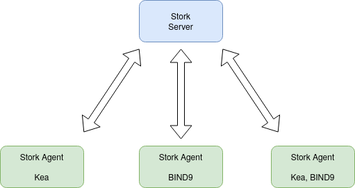
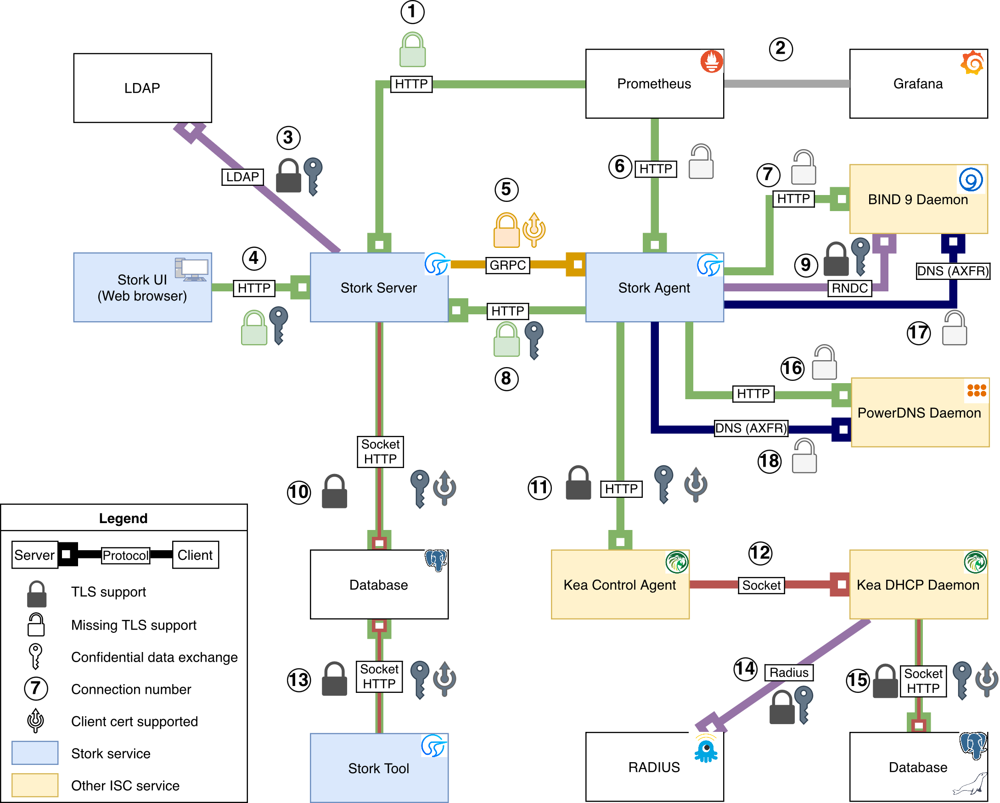

.. _overview:

********
Overview
********

Goals
=====

The goals of the ISC Stork project are:

- To provide monitoring and insight into Kea DHCP operations.
- To provide alerting mechanisms that indicate failures, fault
  conditions, and other unwanted events in Kea DHCP services.
- To permit easier troubleshooting of these services.
- To allow remote configuration of Kea DHCP servers.

Although Stork currently only offers monitoring, insight, alerts,
and configuration for Kea DHCP, we plan to add similar capabilities
for BIND 9 in future versions.

Please refer to the :ref:`glossary` for specific terms used
in this documentation and in the Stork UI.

Architecture
============

Stork is composed of two components: the Stork server (``stork-server``)
and the Stork agent (``stork-agent``).

The Stork server is installed on a stand-alone machine. It connects to
any agents, typically running on other machines, and indirectly (via those agents)
interacts with the Kea DHCP and BIND 9 apps. It provides an integrated,
centralized front end for these apps. Only one Stork server is deployed
in a network.

The Stork agent is installed along with Kea DHCP and/or BIND 9 and
interacts directly with those apps. There may be many
agents deployed in a network, one per machine. The following figure shows
the connections between Stork components, Kea, and BIND 9. It also shows the different
kinds of databases in a typical deployment.

The presented example includes three physical machines, each running a Stork agent
instance and the Kea and/or BIND 9 applications. The leftmost machine includes a Kea
server connected to a database. Kea natively supports two database systems:
MySQL and PostgreSQL. Kea uses a database to store three types of information:

- DHCP leases (this storage is often referred to as a lease database or lease backend),
- DHCP host reservations (this storage is referred to as a host database or host backend),
- Kea configuration information (called the configuration backend).

For more information regarding the supported database backends, please consult
`the Kea Database Administration section of the Kea ARM <https://kea.readthedocs.io/en/latest/arm/admin.html#kea-database-administration>`_.

Note that the Stork server does not communicate directly with the Kea databases.
The lease, host, and configuration information is pulled from the Kea instances
by the Kea control channel, which then relays the data to the Stork server.
Depending on the configuration, Kea may use all the database backends
or only a subset of them, or it may not use any database at all. If it uses
the database backends, they may be combined in the same database instance
or they may be separate instances. The rightmost machine on the figure above
is an example of the Kea server running without a database; in this case it
stores allocated DHCP leases in a CSV file (often called a memfile backend).

The Stork server is connected to its own PostgreSQL database, which has a different
schema than a Kea database and stores the information required for the Stork
server operation. This database is typically installed on the same physical
machine as the Stork server but may also be remote.

.. note::

  Unlike Kea, the Stork server has no concept of replaceable database backends;
  it is integrated only with PostgreSQL. In particular, using MySQL as a
  Stork server database is not supported.

The Stork server retrieves the configuration information from the respective
Kea servers when they are first connected to the Stork server via agents,
then saves the pulled information in its local database and exposes it to
end users via the REST API. The Stork server continues to check the Kea servers
periodically and updates the local database when it finds any configuration changes. It
also pulls the current configuration from the Kea servers before applying
any configuration updates, to minimize the risk of conflicts with any
updates applied directly to the Kea servers (outside of Stork).

.. note::

  The future goal is to make Kea servers fully configurable from Stork, which
  already supports configuring the most frequently changing parameters
  (e.g., host reservations, subnets, shared networks, and selected global parameters).
  However, some configuration capabilities are not yet available via Stork, which means that
  administrators may sometimes need to apply configuration updates directly to
  Kea servers. These Kea servers are the source of the configuration information in
  Stork, so ideally all updates to them would be made via Stork. Even though that
  is not yet an option, we highly recommend
  applying configuration updates via the Stork interface whenever possible. Stork
  provides locking mechanisms to prevent multiple end users from concurrently
  modifying the configuration of the same Kea server; direct configuration updates
  bypass this mechanism, resulting in a risk of configuration conflicts.

Stork uses the ``config-set`` and ``config-write`` Kea commands to save changes related
to global parameters and options, subnets, and shared networks. For this to work, Stork
needs to have write access to the Kea configuration, which is a security decision made
by a Kea administrator. Some deployments may choose to restrict write access;
in such cases, Stork is not able to push configuration changes to Kea.

The host reservations management mechanism does not modify configurations on
disk; instead, it stores host reservations in the database. Therefore, the note above
does not apply to host management.

Preprocessing the Kea and BIND 9 Statistics for the Prometheus Server
=====================================================================

The BIND 9 and Kea DHCP servers provide statistics in their own custom formats.
The Stork agent preprocesses these statistics and converts them into a format
understood by the Prometheus server. The agent acts as a Prometheus exporter
and waits for the Prometheus server to scrape the statistics.

To fetch the statistics, the Kea DHCP daemon must be configured to load the
``stats_cmds`` hook, which is responsible for sharing the statistics through
the Kea REST API. Optionally, the ``subnets_cmds`` hook can be loaded to
provide additional labels for the metrics exported to Prometheus.

The BIND 9 daemon must have a properly configured statistics channel to enable
this feature.

The Stork agent exports only a subset of the available statistics; the user
can limit the exported statistics in the agent configuration file.

Monitoring the Status of Services
=================================

The Stork server continuously monitors the status of the Kea DHCP daemons,
the Kea Control Agent (Kea CA), and the Kea DHCP-DDNS and BIND 9 services, and provides a dashboard
to show their current states.

The statuses are monitored on two levels: the first level is the status of the
machine where Kea or BIND 9 is running. The user can see if the connection to
the agent is established and can view additional information about the machine, such as
the operating system as well as CPU and memory usage.
The second level is the status of the Kea DHCP and BIND 9 daemons. The user can
inspect whether the processes are running; if they are not, the user can see the
reason for the failure.

The Stork server keeps an events log, which contains the history of status
changes of the Kea and BIND 9 services.

Browsing the Logs
=================

The Stork server provides a way to browse the logs of the Kea DHCP and BIND 9
services.

The logs are fetched directly from the filesystem, so the logs can be read
even if the Kea or BIND 9 services are down.

The Stork server can read only the data logged into a file. It cannot read
the logs from the syslog or standard output. The Stork agent must have the
necessary permissions to access the log files.

Viewing the DHCP Data
=====================

The Stork server has extensive capabilities to display the DHCP state and configuration. It
aggregates the data from all connected Kea servers and presents it in a
comprehensive form. The server allows the user to browse all details of all networks in
a single place, even if they are spread across multiple Kea servers.

The Stork server has dedicated pages for viewing the following data:

- Subnets

  The user can see all subnets defined in the Kea servers, and can view
  the subnet details, such as the subnet ID, subnet prefix, related DHCP
  options, and subnet pools.

  The subnet usage statistics are presented only if the ``stats_cmds``
  hook is loaded on the Kea server.

  If a particular subnet is specified on multiple Kea servers, it is
  displayed only once, with a list of server names where it is defined.

- Shared networks

  The user can see all shared networks defined in the Kea servers, and
  can view the shared network details, such as the shared network ID and shared
  network name. The server displays the list of subnets belonging to the shared
  network. The user can see the overall utilization of the shared network as well as
  the utilization of the subnets belonging to the shared network.

  The utilization data and other statistics are presented only if the
  ``stats_cmds`` hook is loaded on the Kea server.

- Host reservations

  The user can see all host reservations defined in the Kea servers. The user
  can view the host reservation details, such as host identifiers, DHCP options,
  and reserved hostname and IP addresses.

  The server can fetch the host reservations from the host database if the
  ``host_cmds`` hook is loaded in Kea.

- Global parameters and DHCP options

  The user can see the global parameters and DHCP options defined on the Kea
  servers.

- High-Availability status

  The user can see the status of the High Availability configuration across the
  Kea servers. The UI presents detailed information about each HA peer;
  in the event of a failure, the user can observe the reason for the failure and
  see how the non-failed server is handling the situation.

  The Stork server gracefully supports the hub-and-spoke Kea feature.

- DHCP daemon details

  The user can see the details of the Kea DHCP daemons. The UI displays the
  daemon version, the database backends, the loaded hooks, and the entire
  configuration in JSON format.

Managing the DHCP Configuration
===============================

One of the features of the Stork server is its ability to modify the Kea DHCP
configuration by calling the Kea hooks or by editing the JSON configuration on
the Stork server side and sending it back to the Kea server.

The following operations are supported:

- Adding, editing, and deleting subnets

  The user can add, edit, and delete subnets on Kea servers. The user can
  also change subnet details, such as the subnet prefix, related DHCP options,
  and subnet pools.

  The ``subnet_cmds`` hook must be loaded on the Kea server to support this feature.

- Adding, editing, and deleting shared networks

  The user can add, edit, and delete shared networks on Kea servers. The
  user can also change shared network details, such as the shared network name,
  the list of subnets belonging to the shared network, and the DHCP options.

  The ``subnet_cmds`` hook must be loaded on the Kea server to support this feature.

- Adding, editing, and deleting host reservations

  The user can add, edit, and delete host reservations on Kea servers. The
  user can change the host reservation details, such as host identifiers, DHCP
  options, and reserved hostnames and IP addresses.

  The ``host_cmds`` hook must be loaded on the Kea server to support this feature.

- Editing global parameters and DHCP options

  The user can edit the global parameters and DHCP options on Kea servers.

Reviewing the Kea Configuration
===============================

The Stork server allows the user to analyze the Kea DHCP configuration and suggest
tweaks and improvements. This solution allows potential issues to be detected,
performance bottlenecks to be addressed, and fields to be identified for optimization.
The server also suggests the hooks that can be loaded to enable more Stork features.

Searching for Leases
====================

The Stork server provides an engine to search for DHCP leases. The user
can search for the leases by the IP address, MAC address, hostname, DUID, or
client identifier. They can also search for all declined leases.

This feature requires the ``lease_cmds`` hook to be loaded in Kea.

The Stork server also displays a list of the leases related to a particular host
reservation.

Monitoring the BIND 9 Service
=============================

The Stork server currently has limited capabilities to monitor the BIND 9 service.
It can display the status of the BIND 9 service, the version of the BIND 9
daemon, and the details of the configured control and statistics channels.
The UI also displays the RNDC keys, if set, and the basic statistics.

The BIND 9 instance must be configured with the control channel to enable
monitoring, and the Stork agent must have the necessary permissions
to access the ``named`` daemon configuration and to execute the RNDC commands.

The BIND 9 statistics channel must be configured to enable the statistics export to Prometheus.
The statistics channel must be configured to enable the statistics export to Prometheus.

Security Design
===============

Stork has been designed with security in mind. The following section describes
the security design and the security features implemented in Stork.

The Stork environment is composed of multiple services: the Stork server, the Stork agent(s), the Kea Control Agent(s), the Kea
DHCP daemon(s), the Kea D2 daemon(s), the BIND 9 daemon(s), the PostgreSQL database(s), and Prometheus. Each service has its own security
considerations.

The following is a diagram of all Stork components and the services that they might interact with;
a typical Stork deployment would have a much simpler subset of components:

   Connections and protocols between Stork components and services

..
  The above diagram may be edited at https://app.diagrams.net/.
  The source file is located in the doc/user/static/ecosystem-protocols.drawio.xml file.

The Stork server is the central component of the Stork environment. It serves the web UI and REST API over the HTTP
protocol (connections no. 1, 4, and 8 on the diagram). The administrator may secure the Stork server by providing a trusted
SSL/TLS certificate. This is recommended, especially when the Stork server is exposed to a public network.
The Stork server may share some statistics with the Prometheus monitoring system; it is strongly recommended to limit
access to the metrics endpoint to the Prometheus server only. The Stork server has no built-in mechanism to limit the access, but this
may be achieved by using a reverse proxy like NGINX or Apache. See the :ref:`server-setup` section for more details.

The Stork server requires a PostgreSQL database to store its data; the connection to the database may be established
over the local socket or over the HTTP protocol (connection no. 10 on the diagram). The first option is more secure,
as it does not expose database traffic to the network, but it requires the database to be installed on the same
machine as the Stork server. The second option allows the database to be installed on a different machine,
securing the connection with SSL/TLS is recommended. The Stork server supports mutual TLS authentication with the
database, which should ensure the highest level of security. In any case, Stork server should use a dedicated database
user with the minimum required permissions, and no one else should have access to the database; the database should be
regularly backed up. See the :ref:`securing-the-database-connection` for more details.

The Stork agent resides on the same machine as the Kea and BIND 9 daemons and is permitted to access their
configuration files and logs and use their APIs. Additionally, it can list the processes running on the machine and read
their details. Therefore, it is recommended to run the Stork agent as a dedicated user with the minimum required
permissions.

The Stork server communicates with the Stork agents over the GRPC protocol (connection no. 5 on the diagram). Stork
has a built-in solution for securing the communication on this channel using the Transport Layer Security (TLS)
protocol: mutual TLS authentication, which ensures that the server and the agent are who they claim to be.
It is self-managed and does not require any additional configuration. The server acts as a Certificate Authority (CA)
and generates the root certificate and the private key, which are stored in the server's database. The server generates
a certificate and a private key for each agent, during the agent-registration process. The agent uses the certificate and
the private key to authenticate itself to the server; the server does not trust the agent's certificate by default. The
server administrator must approve the agent-registration request in the Stork web UI, by
comparing the token displayed in the UI with the token displayed in the agent's logs. If the tokens match, the
administrator can approve the registration request. It is a one-time operation that protects against
"man-in-the-middle" attacks.

Alternatively, new Stork agents can be authorized automatically, if an administrator provides agents with the server token.
This deployment mode might be more useful for automated deployments. The server token is a secret available only to the
administrator on the server UI, which may be provided to the agent during the agent registration process. The agents
registered with this token are automatically approved by the server.
Since the server token is a secret and must be protected, we recommend using it only in secure environments. If the
server token is compromised, the administrator can revoke it in the server UI. See the :ref:`secure-server-agent` for more details.

The Stork agent is responsible for exchanging data between the Stork server and the Kea (connection no. 11 on the
diagram) and BIND 9 (connections no. 7 and 9 on the diagram) daemons. The agent and the daemons are running on the same
machine, so the communication is local; however, it can still be secured.

The Kea Control Agent (Kea CA) supports Basic Auth to authenticate the clients of its REST API, via the control channel used by the
Stork agent. This solution may be enabled to protect the Kea CA from unauthorized access. If it is enabled, the Stork
agent must be configured with the username and password to authenticate itself to the Kea CA. It is recommended to limit
access to this file only to the ``stork-agent`` user. The Kea CA may be configured to serve the REST API over the
HTTPS protocol; enabling this is strongly recommended if the Basic Auth is configured or if the Kea CA listens on
non-localhost interfaces. Additionally, the Kea CA may be configured to require the client certificate to authenticate
clients. The Stork agent offers partial support for mutual TLS authentication. If it recognizes that the Kea CA requires a
client certificate, the Stork agent attaches its GRPC client certificate (the certificate that was obtained during the agent
registration) to the request. This certificate does not pass client-certificate verification by the Kea CA, which means
that the Kea CA must be configured not to verify the client certificate.

Stork's connection to BIND 9 utilizes two protocols: RNDC (control channel, connection no. 9 on the diagram) and HTTP (
statistics channel, connection no. 7 on the diagram). The RNDC protocol may be secured by using RNDC keys; this is
especially recommended if the BIND 9 daemon listens on non-localhost interfaces. The Stork agent retries the RNDC
key from the BIND 9 configuration file; the agent must have the necessary permissions to read this file and use the
``rndc`` and ``named-checkconf`` commands.
The statistics channel is served over the HTTP protocol and may be secured by the SSL/TLS certificate.

The Stork agent acts as a Prometheus exporter for the Kea and BIND 9 statistics. The Prometheus server scrapes the
metrics from the agent over the HTTP protocol (connection no. 6 on the diagram); this connection is unsecure and does not
support TLS. The metrics channel is expected not to be exposed to the public network. It is recommended to configure any
firewall to limit access to the metrics endpoint only to the Prometheus server.

The Stork server supports hooks that may be loaded to provide new authentication methods. If these authentication methods
use a dedicated authentication service, we recommend securing the connection to this service with the SSL/TLS
certificate if the service and hook support it. In particular, the LDAP hook may be configured to use the SSL/TLS (LDAPS)
protocol.
