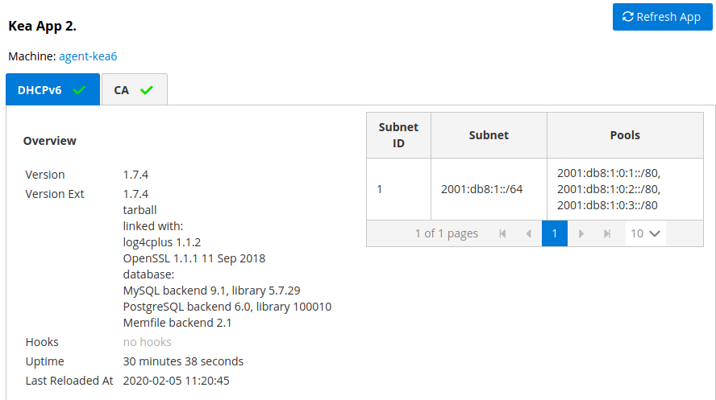
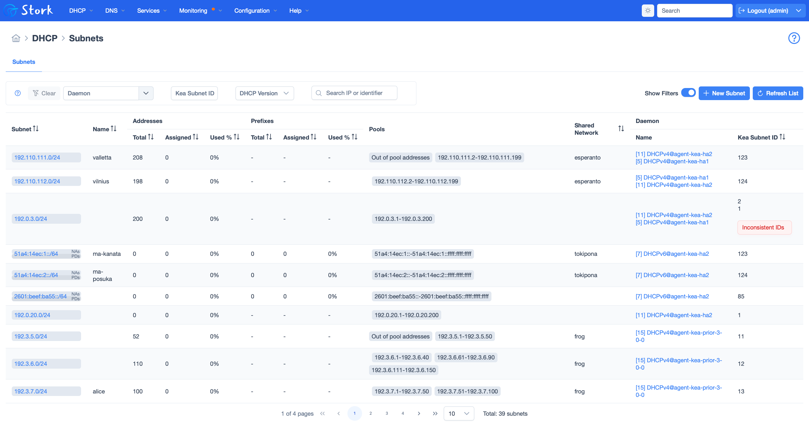
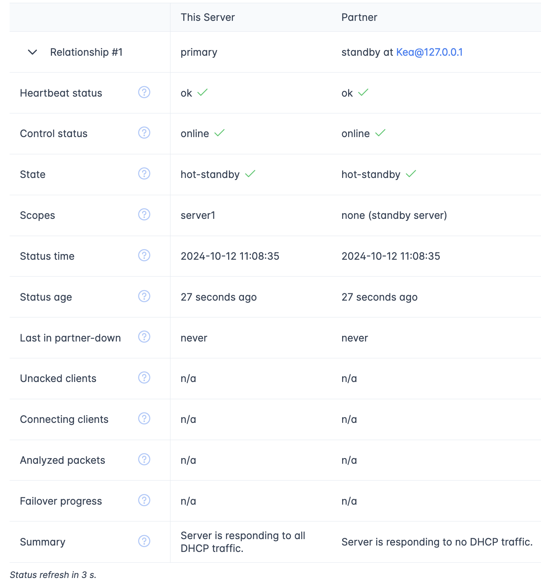

.. _usage:

***********
Using Stork
***********

This section describes how to use the features available in Stork. To
connect to Stork, use a web browser and connect to port 8080 on the Stork server machine. If
``stork-server`` is running on a localhost, it can be reached by navigating to
http://localhost:8080.

Dashboard
=========

The main Stork page presents a dashboard. It contains a panel with
information about DHCP and a panel with events observed or noticed by
the Stork server.

The DHCP Panel
~~~~~~~~~~~~~~

The DHCP panel includes two sections: one for DHCPv4 and one for DHCPv6.
Each section contains three kinds of information:

- a list of up to five subnets with the highest pool utilization
- a list of up to five shared networks with the highest pool utilization
- statistics about DHCP

The Events Panel
~~~~~~~~~~~~~~~~

The Events panel presents the list of the most recent events captured by
the Stork server. There are three event urgency levels: info, warning,
and error. Events pertaining to particular entities, e.g. machines
or applications, provide a link to a web page containing information
about the given object.

The Service Status Panel
~~~~~~~~~~~~~~~~~~~~~~~~

The Service Status Panel displays the current status of all the hosts currently
being monitored by Stork. The information shown includes the hostname, the application
version, the app name, the daemon running on the host, its communication status, the
average number of ACKs sent by the daemon over the previous 15 minutes and 24 hours,
its High Availability (HA) state, whether an HA failure has been detected, and the
host's running uptime. More details about the meaning of these status indicators is
included in the following sections.

Managing Users
==============

A default administrator account is created when Stork is initially installed. It can be used to
sign in to the system via the web interface, with the username ``admin`` and password ``admin``.

To see a list of existing users, click on the ``Configuration`` menu and
choose ``Users``. There will be at least one user, ``admin``.

To add a new user, click ``Create User Account``. A new tab opens to
specify the new account parameters. Some fields have specific
restrictions:

- The ``username`` can consist of only letters, numbers, and underscores
  (_).
- The ``e-mail`` field is optional, but if specified, it must be a
  well-formed e-mail address.
- The ``firstname`` and ``lastname`` fields are mandatory for the user accounts managed
  by Stork. They are optional for authentication methods provided by hooks.
- The ``password`` must only contain letters, digits, @, ., !, +, or -,
  and must be at least eight characters long.

Currently, each user is associated with one of the two predefined groups
(roles), which are ``super-admin`` or ``admin``; one of these must be selected
when a user account is created. Both types of users can view Stork
status screens, edit interval and reporting configuration settings, and
add/remove machines for monitoring. ``super-admin`` users can also
create and manage user accounts.

Once the new user account information has been specified and all
requirements are met, the ``Save`` button becomes active and the new
account can be enabled.

Changing a User Password
~~~~~~~~~~~~~~~~~~~~~~~~

An initial password is assigned by the administrator when a user
account is created; each user should change their password when first
logging into the system. To change the password, click on the
``Profile`` menu and choose ``Settings`` to display the user profile
information. Click on ``Change password`` in the menu bar on the left
and specify the current password in the first input box. The new
password must be entered and confirmed in the second and third input
boxes, and must meet the password requirements specified in the
previous section. When all entered data is valid, the ``Save`` button
is activated to change the password.

Runtime Configuration Settings
==============================

The Stork server is started with the command-line switches and/or environment
variables controlling some of its behavior. However, the server also exposes
other configuration options only available at runtime from the web UI.
To access these options, select ``Configuration`` from the menu and choose
``Settings``. There are four classes of settings available: ``Security``,
``Automatic software updates checking``, ``Intervals``, and ``Grafana``.

``Security`` settings currently contain only one option, which controls whether
the machine registration REST API endpoint is enabled. New machines
connect to this endpoint when they begin the registration. To avoid
malicious attempts to register fake machines in the Stork server, it is practical
to uncheck the ``Enable machine registration`` option when no new registrations
are expected. The option can be re-enabled at any time when new registrations
are required. Unchecking the option does not affect the ability to re-register
existing machines.

.. _usage-online-version-check-setting:

``Automatic software updates checking`` setting controls whether Stork should
automatically check for software updates available for Kea, BIND 9 and Stork itself.
To be able to do that, Stork server downloads a `JSON file <https://www.isc.org/versions.json>`_
with the latest software releases metadata.
This feature can be disabled using this setting. When disabled, all the feedback displayed
regarding software versions detected by Stork will be generated based on offline built-in
information stored as a JSON file.

.. note::

   The offline JSON file location is under path ``/etc/stork/versions.json``
   in the Stork server installation location. If the ``Automatic software updates checking``
   feature is disabled for any reason, the offline JSON file content can be
   updated manually. It is suggested to update it with the content published
   under `https://www.isc.org/versions.json <https://www.isc.org/versions.json>`_
   URL. The content of this file is maintained by ISC and is kept up-to-date
   with current Stork, Kea and BIND 9 releases on a "best-effort" basis.

``Intervals`` settings specify the configuration of "pullers." A puller is a
mechanism in Stork that triggers a specific action at the
specified interval. Each puller has its own specific action and
interval. The puller interval is specified in seconds and designates
the time period between the completion of the previously invoked action
and the beginning of the next invocation of this action. For example, if
the Kea Hosts Puller Interval is set to 10 seconds and it
takes five seconds to pull the hosts information, the time period between the
starts of the two consecutive attempts to pull the hosts information is
15 seconds.

The pull time varies between deployments and depends
on the amount of information pulled, network congestion, and other factors.
The interval setting guarantees that there is a constant idle time between
any consecutive attempts.

The ``Grafana`` setting allows to specify the URL of the Grafana instance used with Stork.

Connecting and Monitoring Machines
==================================

Monitoring a Machine
~~~~~~~~~~~~~~~~~~~~

Monitoring of registered machines is accomplished via the ``Services``
menu, under ``Machines``. A list of currently registered machines is
displayed, with multiple pages available if needed.

A filtering mechanism that acts as an omnibox is available. Via a
typed string, Stork can search for an address, agent version,
hostname, OS, platform, OS version, kernel version, kernel
architecture, virtualization system, or host ID field.

The state of a machine can be inspected by clicking its hostname; a
new tab opens with the machine's details. Multiple tabs can be open at
the same time, and clicking ``Refresh`` updates the available information.

The machine state can also be refreshed via the ``Action`` menu. On the
``Machines`` list, each machine has its own menu; click on the
triple-lines button at the right side and choose the ``Refresh`` option.

Disconnecting From a Machine
~~~~~~~~~~~~~~~~~~~~~~~~~~~~

To stop monitoring a machine, go to the ``Machines`` list, find the
machine to stop monitoring, click on the triple-lines button at the
right side, and choose ``Delete``. This terminates the connection
between the Stork server and the agent running on the machine, and the
server no longer monitors that machine; however, the ``stork-agent`` process
continues running. Complete shutdown of the
``stork-agent`` process must be done manually, e.g. by connecting to the machine
using SSH and stopping the agent there. For example, when the Stork agent
has been installed from packages, run:

.. code-block:: console

    $ sudo systemctl stop isc-stork-agent

Alternatively:

.. code-block:: console

    $ sudo killall -9 stork-agent

Dumping Diagnostic Information Into a File
~~~~~~~~~~~~~~~~~~~~~~~~~~~~~~~~~~~~~~~~~~

It is sometimes difficult or
impossible to diagnose issues without seeing the actual
logs, database contents, and configuration files. Gathering such information can
be challenging for a user because it requires looking into many places like
databases, remote machine logs, etc.

Stork makes it convenient for users to gather diagnostic information from the
selected machines with a single click. Navigate to the ``Machines`` page
where all monitored machines are listed, click on the ``Action`` button
for a selected machine, and choose the ``Dump Troubleshooting Data`` option. Alternatively,
navigate to the selected machine's page and click on the ``Dump Troubleshooting Data``
button at the bottom of the page. In both cases, the Stork server
automatically gathers useful diagnostics information and offers it for download as a
``tar.gz`` file. The downloaded package contains configurations, log tails,
``stork-server`` settings, warning and error-level events, high-availability
service states, etc.

.. note::

  Stork sanitizes passwords and other sensitive information when it creates
  the package.

The tarball can be easily sent via email or attached to a bug report.

Communication Status With the Monitored Machines
~~~~~~~~~~~~~~~~~~~~~~~~~~~~~~~~~~~~~~~~~~~~~~~~

The communication status with the monitored agents and daemons is shown on
the apps pages for the respective daemons. To see the detailed status for all
apps and daemons on a single page, navigate to ``Monitoring`` and then
``Communication``. If this page shows no communication issues,
all connected systems are online. If there are issues, the page lists a hierarchical view
of the Stork agents, Kea Control Agents, and the daemons, highlighting any
for which communication failures have occurred. The communication failures
may be caused by a process failure (e.g., a Stork agent failure) or a machine
failure. With a process failure, it is possible that other daemons are still
running, but the lack of agent connectivity may cause an inaccurate status to be reported.
With a machine failure, all processes on
the culprit machine are down. The Stork server tries to provide accurate data
about the states of all processes, but some information may be unavailable.

Monitoring Applications
=======================

Application Status
~~~~~~~~~~~~~~~~~~

Kea DHCP applications discovered on connected machines are
listed via the top-level menu bar, under ``Services``. The list view includes the
application version, application status, and some machine details. The
``Action`` button is also available, to refresh the information about
the application.

The application status displays a list of daemons belonging to the
application. Several daemons may be presented in the application
status columns; typically, they include DHCPv4, DHCPv6, DDNS, and the Kea Control
Agent (CA).

Stork uses ``rndc`` to retrieve the application's status. It looks for
the ``controls`` statement in the configuration file, and uses the
first listed control point to monitor the application.

Furthermore, the Stork agent can be used as a Prometheus exporter
if ``named`` is built with ``json-c``, because
Stork gathers statistics via the JSON statistics API. The
``named.conf`` file must have ``statistics-channel`` configured;
the exporter queries the first listed channel. Stork is able to export the
most metrics if ``zone-statistics`` is set to ``full`` in the
``named.conf`` configuration.

For Kea, the listed daemons are those that Stork finds in the CA
configuration file. A warning is displayed for any daemons from
the CA configuration file that are not running. When the Kea
installation is simply using the default CA configuration file, which
includes configuration of daemons that are never intended to be
launched, it is recommended to remove (or comment out) those
configurations to eliminate unwanted warnings from Stork about
inactive daemons.

Friendly App Names
~~~~~~~~~~~~~~~~~~

Every app connected to Stork is assigned a default name. For example,
if a Kea app runs on the machine ``abc.example.org``, this app's default name
is ``kea@abc.example.org``. Similarly, if a BIND 9 app runs on the machine
with the address ``192.0.2.3``, the resulting app name is ``bind9@192.0.2.3``.
If multiple apps of a given type run on the same machine, a postfix with a
unique identifier is appended to the duplicated names, e.g. ``bind9@192.0.2.3%56``.

The default app names are unique so that the user can distinguish them in the
dashboard, apps list, events panel, and other views. However, the default names
may become lengthy when machine names consist of fully qualified domain names (FQDNs).
When machines' IP addresses are used instead of FQDNs, the app names are less
meaningful for someone not familiar with addressing in the managed network.
In these cases, users may prefer replacing the default app names with more
descriptive ones.

Suppose there are two Kea DHCP servers in the network, one on the first floor of a building
and one on the second floor. A user may assign the names ``Floor 1 DHCP``
and ``Floor 2 DHCP`` to the respective DHCP servers in this case.
The new names need not have the same pattern as the default names and may
contain spaces. The @ character is not required, but if it is present,
the part of the name following this character (and before an optional %
character) must be an address or name of the machine monitored in Stork.
For example, the names ``dhcp-server@floor1%123`` and ``dhcp-server@floor1``
are invalid unless ``floor1`` is a monitored machine's name. The special
notation using two consecutive @ characters can be used to suppress this
check. The ``dhcp-server@@floor1`` is a valid name even if ``floor1`` is
not a machine's name. In this case, ``floor1`` can be a physical location
of the DHCP server in a building.

To modify an app's name, navigate to the selected app's view. For example,
select ``Services`` from the top menu bar and then click ``Kea Apps``.
Select an app from the presented apps list, then locate and click the pencil
icon next to the app name in the app view. In the displayed dialog box,
type the new app name. If the specified name is valid, the ``Rename``
button is enabled; click this button to submit the new name. The ``Rename``
button is disabled if the name is invalid. In this case, a hint is displayed
to explain the issues with the new name.

Subnets and Networks
~~~~~~~~~~~~~~~~~~~~

IPv4 and IPv6 Subnets per Kea Application
------------------------------------------

One of the primary configuration aspects of any network is the layout
of IP addressing. This is represented in Kea with IPv4 and IPv6
subnets. Each subnet represents addresses used on a physical
link. Typically, certain parts of each subnet ("pools") are delegated
to the DHCP server to manage. Stork is able to display this
information.

One way to inspect the subnets and pools within Kea is by looking at
each Kea application to get an overview of the configurations a
specific Kea application is serving. A list of configured subnets on
that specific Kea application is displayed. The following picture
shows a simple view of the Kea DHCPv6 server running with a single
subnet, with three pools configured in it.

IPv4 and IPv6 Subnets in the Whole Network
------------------------------------------

It is convenient to see a complete overview of all subnets
configured in the network that are being monitored by Stork. Once at least one
machine with the Kea application running is added to Stork, click on
the ``DHCP`` menu and choose ``Subnets`` to see all available subnets. The
view shows all IPv4 and IPv6 subnets, with the address pools and links
to the applications that are providing them. An example view of all
subnets in the network is presented in the figure below.

Stork provides filtering capabilities; it is possible to
choose to see IPv4 only, IPv6 only, or both. There is also an
omnisearch box available where users can type a search string.
For strings of four characters or more, the filtering takes place
automatically, while shorter strings require the user to hit
Enter. For example, in the above example it is possible to show only
the first (192.0.2.0/24) subnet by searching for the *0.2* string. One
can also search for specific pools, and easily filter the subnet with
a specific pool, by searching for part of the pool range,
e.g. *3.200*. The input box accepts a text string that can be a part of the
subnet or shared network name.

Stork displays pool utilization for each subnet, with
the absolute number of addresses allocated and usage percentage.
There are two thresholds: 80% (warning; the pool utilization
bar turns orange) and 90% (critical; the pool utilization bar
turns red).

Subnet Names
------------

Kea allows storing any arbitrary data related to a subnet in the ``user-context``
field. This field is a JSON object. It may be used to store some metadata about
the subnet, such as the name of the location where the subnet is used, the name
of the department, name of related service or any other information that is
useful for the network administrator.

Stork displays the subnet's user context on the subnet page. Additionally, the
value of the ``subnet-name`` key is displayed in the subnet list view. This
allows the network administrator to quickly identify the subnet by its name.

The subnet name can be used to filter the subnets on the subnet list page and
in the global search box.

IPv4 and IPv6 Networks
----------------------

Kea uses the concept of a shared network, which is essentially a stack
of subnets deployed on the same physical link. Stork
retrieves information about shared networks and aggregates it across all
configured Kea servers. The ``Shared Networks`` view allows the
inspection of networks and the subnets that belong in them. Pool
utilization is shown for each subnet.

Host Reservations
~~~~~~~~~~~~~~~~~

Listing Host Reservations
-------------------------

Kea DHCP servers can be configured to assign static resources or parameters to the
DHCP clients communicating with the servers. Most commonly these resources are the
IP addresses or delegated prefixes; however, Kea also allows assignment of hostnames,
PXE boot parameters, client classes, DHCP options, and other parameters. The mechanism by which
a given set of resources and/or parameters is associated with a given DHCP client
is called "host reservations."

A host reservation consists of one or more DHCP identifiers used to associate the
reservation with a client, e.g. MAC address, DUID, or client identifier;
and a collection of resources and/or parameters to be returned to the
client if the client's DHCP message is associated with the host reservation by one
of the identifiers. Stork can detect existing host reservations specified both in
the configuration files of the monitored Kea servers and in the host database
backends accessed via the Kea Host Commands premium hook library.

All reservations detected by Stork can be listed by selecting the ``DHCP``
menu option and then selecting ``Host Reservations``.

The first column in the presented view displays one or more DHCP identifiers
for each host in the format ``hw-address=0a:1b:bd:43:5f:99``, where
``hw-address`` is the identifier type. In this case, the identifier type is
the MAC address of the DHCP client for which the reservation has been specified.
Supported identifier types are described in the following sections of the Kea
Administrator Reference Manual (ARM):
`Host Reservations in DHCPv4 <https://kea.readthedocs.io/en/latest/arm/dhcp4-srv.html#host-reservations-in-dhcpv4>`_
and `Host Reservations in DHCPv6 <https://kea.readthedocs.io/en/latest/arm/dhcp6-srv.html#host-reservations-in-dhcpv6>`_.

The next two columns contain the static assignments of the IP addresses and/or
prefixes delegated to the clients. There may be one or more such IP reservations
for each host.

The ``Hostname`` column contains an optional hostname reservation, i.e., the
hostname assigned to the particular client by the DHCP servers via the
Hostname or Client FQDN option.

The ``Global/Subnet`` column contains the prefixes of the subnets to which the reserved
IP addresses and prefixes belong. If the reservation is global, i.e., is valid
for all configured subnets of the given server, the word "global" is shown
instead of the subnet prefix.

Finally, the ``App Name`` column includes one or more links to
Kea applications configured to assign each reservation to the
client. The number of applications is typically greater than one
when Kea servers operate in the High Availability setup. In this case,
each of the HA peers uses the same configuration and may allocate IP
addresses and delegated prefixes to the same set of clients, including
static assignments via host reservations. If HA peers are configured
correctly, the reservations they share will have two links in the
``App Name`` column. Next to each link there is a label indicating
whether the host reservation for the given server has been specified
in its configuration file or a host database (via the Host Commands premium
hook library).

The ``Filter Hosts`` input box is located above the ``Hosts`` table. It
allows hosts to be filtered by identifier types, identifier values, IP
reservations, and hostnames, and by globality, i.e., ``is:global`` and ``not:global``.
When filtering by DHCP identifier values, it is not necessary to use
colons between the pairs of hexadecimal digits. For example, the
reservation ``hw-address=0a:1b:bd:43:5f:99`` will be found
whether the filtering text is ``1b:bd:43`` or ``1bbd43``.

The filtering mechanism also recognizes a set of keywords that can be
used in combination with integer values to search host reservations by
selected properties. For example, type:

   - ``appId:2`` to search the host reservations belonging to the app with ID 2.
   - ``subnetId:78`` to search the host reservations in subnet with ID 78. In this
     case the ID is the one assigned to the subnet by Stork.
   - ``keaSubnetId:123`` to search the host reservations in subnets with ID 123
     assigned in the Kea configurations.

Host Reservation Usage Status
-----------------------------

Clicking on a selected host in the host reservations list opens a new tab
that shows host details. The tab also includes information about
reserved address and delegated prefix usage. Stork needs to query the Kea
servers to gather the lease information for each address and prefix in the
selected reservation; it may take several seconds or longer before this
information is available. The lease information can be refreshed using the
``Leases`` button at the bottom of the tab.

The usage status is shown next to each IP address and delegated prefix.
Possible statuses and their meanings are listed in the table below.

.. table:: Possible IP reservation statuses
   :widths: 10 90

   +-----------------+---------------------------------------------------------------+
   | Status          | Meaning                                                       |
   +=================+===============================================================+
   | ``in use``      | There are valid leases assigned to the client. The client     |
   |                 | owns the reservation, or the reservation includes the         |
   |                 | ``flex-id`` or ``circuit-id`` identifier, making it impossible|
   |                 | to detect conflicts (see note below).                         |
   +-----------------+---------------------------------------------------------------+
   | ``expired``     | At least one of the leases assigned to the client owning      |
   |                 | the reservation is expired.                                   |
   +-----------------+---------------------------------------------------------------+
   | ``declined``    | The address is declined on at least one of the Kea servers.   |
   +-----------------+---------------------------------------------------------------+
   | ``in conflict`` | At least one of the leases for the given reservation is       |
   |                 | assigned to a client that does not own this reservation.      |
   +-----------------+---------------------------------------------------------------+
   | ``unused``      | There are no leases for the given reservation.                |
   +-----------------+---------------------------------------------------------------+

View status details by expanding a selected address or delegated prefix row.
Clicking on the selected address or delegated prefix navigates to the leases
search page, where all leases associated with the address or prefix can be
listed.

.. note::

   Detecting ``in conflict`` status is currently not supported for host
   reservations with the ``flex-id`` or ``circuit-id`` identifiers. If there are
   valid leases for such reservations, they are marked ``in use`` regardless
   of whether the conflict actually exists.

Sources of Host Reservations
----------------------------

There are two ways to configure Kea servers to use host reservations. First,
the host reservations can be specified within the Kea configuration files; see
`Host Reservations in DHCPv4 <https://kea.readthedocs.io/en/latest/arm/dhcp4-srv.html#host-reservations-in-dhcpv4>`_
for details. The other way is to use a host database backend, as described in
`Storing Host Reservations in MySQL or PostgreSQL <https://kea.readthedocs.io/en/latest/arm/dhcp4-srv.html#storing-host-reservations-in-mysql-or-postgresql>`_.
The second solution requires the given Kea server to be configured to use the
Host Commands premium hook library (``host_cmds``). This library implements control commands used
to store and fetch the host reservations from the host database to which the Kea
server is connected. If the ``host_cmds`` hook library is not loaded, Stork
only presents the reservations specified within the Kea configuration files.

Stork periodically fetches the reservations from the host database backends
and updates them in the local database. The default interval at which Stork
refreshes host reservation information is set to 60 seconds. This means that
an update in the host reservation database is not visible in Stork until
up to 60 seconds after it was applied. This interval is configurable in the
Stork interface.

.. note::

   The list of host reservations must be manually refreshed by reloading the
   browser page to see the most recent updates fetched from the Kea servers.

Lease Search
~~~~~~~~~~~~

Stork can search DHCP leases on monitored Kea servers, which is helpful
for troubleshooting issues with a particular IP address or delegated prefix.
It is also helpful in resolving lease allocation issues for certain DHCP clients.
The search mechanism utilizes Kea control commands to find leases on the monitored
servers. Operators must ensure that any Kea servers on which they intend to search
the leases have the `Lease Commands hook library <https://kea.readthedocs.io/en/latest/arm/hooks.html#lease-cmds-lease-commands>`_ loaded. Stork cannot search leases on Kea instances without
this library.

The lease search is available via the ``DHCP -> Lease Search`` menu. Enter one
of the searched lease properties in the search box:

- IPv4 address, e.g. ``192.0.2.3``
- IPv6 address or delegated prefix without prefix length, ``2001:db8::1``
- MAC address, e.g. ``01:02:03:04:05:06``
- DHCPv4 Client Identifier, e.g. ``01:02:03:04``
- DHCPv6 DUID, e.g. ``00:02:00:00:00:04:05:06:07``
- Hostname, e.g. ``myhost.example.org``

All identifier types can also be specified using notation with spaces,
e.g. 01 02 03 04 05 06, or notation with hexadecimal digits only, e.g. 010203040506.

To search all declined leases, type ``state:declined`` in the search box. Be aware that this query may
return a large result if there are many declined leases, and thus the query
processing time may also increase.

Searching using partial text is currently unsupported. For example, searching by
partial IPv4 address ``192.0.2`` is not accepted by the search box. Partial MAC
address ``01:02:03`` is accepted but will return no results. Specify the complete
MAC address instead, e.g. ``01:02:03:04:05:06``. Searching leases in states other
than ``declined`` is also unsupported. For example, the text ``state:expired-reclaimed``
is not accepted by the search box.

The search utility automatically recognizes the specified lease type property and
communicates with the Kea servers to find leases using appropriate commands. Each
search attempt may result in several commands to multiple Kea servers; therefore,
it may take several seconds or more before Stork displays the search results.
If some Kea servers are unavailable or return an error, Stork
shows leases found on the servers which returned a "success" status, and displays a
warning message containing the list of Kea servers that returned an error.

If the same lease is found on two or more Kea servers, the results list contains
all that lease's occurrences. For example, if there is a pair of servers cooperating
via the High Availability hook library, the servers exchange the lease information, and each of them
maintains a copy of the lease database. In that case, the lease search on these
servers typically returns two occurrences of the same lease.

To display the detailed lease information, click the expand button (``>``) in the
first column for the selected lease.

Kea High Availability Status
~~~~~~~~~~~~~~~~~~~~~~~~~~~~

To check the High Availability (HA) status of a machine, go to the ``Services -> Kea Apps``
menu. On the Kea Apps page, click on a machine name in the list and scroll
down to the High Availability section. This information is
periodically refreshed according to the configured interval of the
Kea status puller (see ``Configuration`` -> ``Settings``).

Kea HA supports advanced resilience configurations with one central
server (hub) connected to multiple servers providing DHCP service in
different network segments (spokes). This configuration model is described
in the `Hub and Spoke Configuration section in the Kea ARM
<https://kea.readthedocs.io/en/latest/arm/hooks.html#hub-and-spoke-configuration>`_.
Internally, Kea maintains a separate state machine for each connection between
the hub and a server; we call this state machine a ``relationship``. The
hub has many relationships, and each spoke has a single relationship with the hub.
Stork presents HA status for each relationship separately (e.g., ``Relationship #1``,
``Relationship #2``, etc.). Note that each relationship may be in a different state.
For example: a hub may be in the ``partner-down`` state for ``Relationship #1``
and in the ``hot-standby`` state for ``Relationship #2``. The hub relationship
states depend on the availability of the respective spoke servers.

See the `High Availability section in the
Kea ARM
<https://kea.readthedocs.io/en/latest/arm/hooks.html#libdhcp-ha-so-high-availability-outage-resilience-for-kea-servers>`_
for details about the roles of the servers within the HA setup.

To see more information, click on the arrow button to the left of
each HA relationship to see the status details. The following picture shows a typical
High Availability status view for a relationship.

``This Server`` is the DHCP server (daemon)
whose application status is currently displayed; the ``Partner`` is its
active HA partner belonging to the same relationship. The partner belongs
to a different Kea instance running on a different machine; this machine may or
may not be monitored by Stork. The statuses of both servers are fetched by sending
the `status-get
<https://kea.readthedocs.io/en/latest/arm/hooks.html#the-status-get-command>`_
command to the Kea server whose details are displayed (``This Server``).
In the load-balancing and hot-standby modes, the server
periodically checks the status of its partner by sending it the
``ha-heartbeat`` command. Therefore, this information is not
always up-to-date; its age depends on the heartbeat command interval
(by default 10 seconds). The status of the partner returned by
Stork includes the age of the displayed status information.

The Stork status information contains the role, state, and scopes
served by each server. In the typical case, both servers are in
load-balancing state, which means that both are serving DHCP
clients. If the ``partner`` crashes, ``This Server`` transitions to
the ``partner-down`` state , which will be indicated in this view.
If ``This Server`` crashes, it will manifest as a communication
problem between Stork and the server.

The High Availability view also contains information about the
heartbeat status between the two servers, and information about
failover progress. The failover progress information is only
presented when one of the active servers has been unable to
communicate with the partner via the heartbeat exchange for a
time exceeding the ``max-heartbeat-delay`` threshold. If the
server is configured to monitor the DHCP traffic directed to the
partner, to verify that the partner is not responding to this
traffic before transitioning to the ``partner-down`` state, the
number of ``unacked`` clients (clients which failed to get a lease),
connecting clients (all clients currently trying to get a lease from
the partner), and analyzed packets are displayed. The system
administrator may use this information to diagnose why the failover
transition has not taken place or when such a transition is likely to
happen.

More about the High Availability status information provided by Kea can
be found in the `Kea ARM
<https://kea.readthedocs.io/en/latest/arm/hooks.html#the-status-get-command>`_.

Viewing the Kea Log
~~~~~~~~~~~~~~~~~~~

Stork offers a simple log-viewing mechanism to diagnose issues with
monitored applications.

.. note::

   This mechanism currently only supports viewing Kea log
   files; viewing BIND 9 logs is not yet supported. Monitoring other
   logging locations such as stdout, stderr, or syslog is also not
   supported.

Kea can be configured to save logs to multiple destinations. Different types
of log messages may be output into different log files: syslog, stdout,
or stderr. The list of log destinations used by the Kea application
is available on the ``Kea Apps`` page: click on a Kea app to view its details,
and then select a Kea daemon by clicking on the appropriate tab,
e.g. ``DHCPv4``, ``DHCPv6``, ``DDNS``, or ``CA``. Then, scroll down to the ``Loggers`` section.

This section contains a table with a list of configured loggers for
the selected daemon. For each configured logger, the logger's name,
logging severity, and output location are presented. The possible output
locations are: log file, stdout, stderr, or syslog. Stork can
display log output to log files, and shows a link to the associated
file.
Loggers that send output to stdout, stderr, and syslog are also listed,
but Stork is unable to display them.

Clicking on the selected log file navigates to its log viewer.
By default, the viewer displays the tail of the log file, up to 4000 characters.
Depending on the network latency and the size of the log file, it may take
several seconds or more before the log contents are fetched and displayed.

The log viewer title bar comprises three buttons. The button with the refresh
icon triggers a log-data fetch without modifying the size of the presented
data. Clicking on the ``+`` button extends the size of the viewed log tail
by 4000 characters and refreshes the data in the log viewer. Conversely,
clicking on the ``-`` button reduces the amount of presented data by
4000 characters. Each time any of these buttons is clicked, the viewer
discards the currently presented data and displays the latest part of the
log file tail.

Please keep in mind that extending the size of the viewed log tail may
slow down the log viewer and increase network congestion as
the amount of data fetched from the monitored machine grows.

Viewing the Kea Configuration as a JSON Tree
~~~~~~~~~~~~~~~~~~~~~~~~~~~~~~~~~~~~~~~~~~~~

Kea uses JavaScript Object Notation (JSON) to represent its configuration
in the configuration files and the command channel. Parts of the Kea
configuration held in the `Configuration Backend <https://kea.readthedocs.io/en/latest/arm/config.html#kea-configuration-backend>`_
are also converted to JSON and returned over the control channel in that
format. The diagnosis of issues with a particular server often begins by
inspecting its configuration.

In the ``Kea Apps`` view, select the appropriate tab for the daemon
configuration to be inspected, and then click on the ``Raw Configuration``
button. The displayed tree view comprises the selected daemon's
configuration fetched using the Kea ``config-get`` command.

.. note::

   The ``config-get`` command returns the configuration currently in use
   by the selected Kea server. It is a combination of the configuration
   read from the configuration file and from the config backend, if Kea uses
   the backend. Therefore, the configuration tree presented in Stork may
   differ (sometimes significantly) from the configuration file contents.

The nodes with complex data types can be individually expanded and
collapsed. All nodes can also be expanded or collapsed by toggling
the ``Expand`` button. When expanding nodes
with many sub-nodes, they may be paginated to avoid degrading browser
performance.

Click the ``Refresh`` button to fetch and display the latest configuration.
Click ``Download`` to download the entire configuration into a text file.

.. note::

   Some configuration fields may contain sensitive data (e.g. passwords
   or tokens). The content of these fields is hidden, and a placeholder is shown.
   Configurations downloaded as JSON files by users other than super-admins contain
   null values in place of the sensitive data.

Configuration Review
~~~~~~~~~~~~~~~~~~~~

Kea DHCP servers are controlled by numerous configuration parameters, and there is a
risk of misconfiguration or inefficient server operation if those parameters
are misused. Stork can help determine typical problems in a Kea server
configuration, using built-in configuration checkers.

Stork generates configuration reports for a monitored Kea daemon when it
detects that the daemon's configuration has changed. To view the reports for the daemon,
navigate to the application page and select one of the daemons. The
``Configuration Review Reports`` panel lists issues and proposed configuration
updates generated by the configuration checkers. Each checker focuses on one
particular problem.

If some reports are considered false alarms, it is possible to
disable some configuration checkers for a selected daemon or globally for all
daemons. Click the ``Checkers`` button to open the list of available checkers and
their current state. Click on the values in the ``State`` column for the respective
checkers until they are in the desired states. Besides enabling and disabling
the checker, it is possible to configure it to use the globally specified
setting (i.e., globally enabled or globally disabled). The global settings
control the checker states for all daemons for which explicit states are not
selected.

Select ``Configuration -> Review Checkers`` from the menu bar to modify the
global states. Use the checkboxes in the ``State`` column to modify the global
states for the respective checkers.

The ``Selectors`` listed for each checker indicate the types of daemons whose
configurations they validate:

- ``each-daemon`` - run for all types of daemons
- ``kea-daemon`` - run for all Kea daemons
- ``kea-ca-daemon`` - run for Kea Control Agents
- ``kea-dhcp-daemon`` - run for DHCPv4 and DHCPv6 daemons
- ``kea-dhcp-v4-daemon`` - run for Kea DHCPv4 daemons
- ``kea-dhcp-v6-daemon`` - run for Kea DHCPv6 daemons
- ``kea-d2-daemon`` - run for Kea D2 daemons
- ``bind9-daemon`` - run for BIND 9 daemons

The ``Triggers`` indicate the conditions under which the checkers are executed. Currently,
there are three types of triggers:

- ``manual`` - run on user's request
- ``config change`` - run when daemon configuration change has been detected
- ``host reservations change`` - run when a change in the Kea host reservations database has been detected

The selectors and triggers are not configurable by users.

Synchronizing Kea Configurations
~~~~~~~~~~~~~~~~~~~~~~~~~~~~~~~~

Stork pullers periodically check Kea configurations against the local copies
stored in the Stork database. These local copies are only updated when Stork
detects any mismatch. This approach works fine in most cases and eliminates
the overhead of unnecessarily updating the local database. However, there are
possible scenarios when a mismatch between the configurations is not detected,
but it is still desirable to fetch and repopulate the configurations from the Kea
servers to Stork.

There are many internal operations in Stork that may be occurring when a configuration change
is detected (e.g., populating host reservations, log viewer initialization,
configuration reviews, and many others). Resynchronizing the configurations from Kea
triggers all these tasks. The resynchronization may correct some data integrity issues that
sometimes occur due to software bugs, network errors, or any other reason.

To schedule a configuration synchronization from the Kea servers, navigate to
``Services`` and then ``Kea Apps``, and click on the ``Resynchronize Kea Configs`` button.
The pullers fetch and populate the updated configuration data, but this operation
takes time, depending on the configured puller intervals. Ensure the pullers
are not disabled on the ``Settings`` page; otherwise, the configurations will
never re-synchronize.

The Events Page
===============

The Events page presents a list of all events. It allows events
to be filtered by:

- urgency level
- machine
- application type (Kea, BIND 9)
- daemon type (``dhcp4``, ``dhcp6``, ``named``, etc.)
- the user who caused a given event (available only to users in the ``super-admin`` group).

.. _usage-software-versions-page:

The Software Versions Page
==========================

The Software Versions page, which can be found under the ``Monitoring -> Software versions`` menu,
provides information about the Kea, Stork, and BIND 9 software versions currently running on
monitored machines. It consists of two main parts, described below.

Summary of ISC Software Versions Detected by Stork
~~~~~~~~~~~~~~~~~~~~~~~~~~~~~~~~~~~~~~~~~~~~~~~~~~

Stork can identify the ISC software used on all authorized machines and
check whether those software packages are up-to-date. The summary table indicates whether there are software updates available
for any of the versions that are running, with messages that show how critical those updates are.
The table also includes whether the machine's Stork agent version matches the Stork server version.
Stork server's version is also checked. If an update is available, the notification message is displayed
right above the Summary table.

.. note::

   The version of the Stork server and all Stork agents should match; e.g.
   if the Stork server version is ``2.0.0``, all Stork agents should also be version ``2.0.0``.

For each machine where the Kea server is found, Stork also checks whether all the Kea daemons use matching versions.

.. note::

   If the Kea server has more than one daemon active, they should all use
   the same version; e.g. if the Kea server has active daemons ``DHCPv4``, ``DHCPv6`` and ``DDNS``,
   and the ``DHCPv4`` daemon is version ``2.6.1``, all other Kea daemons (``DHCPv6`` and ``DDNS``)
   should be version ``2.6.1``.

The table includes color-coded notices about the importance of upgrading the Kea, BIND 9, or Stork
software, based on the software version checks performed.
The summary table groups the machines by severity and sorts them in descending order.

ISC advises reviewing the summaries for machines with red and yellow severity and updating those software versions.

Kea, BIND 9, and Stork Current Releases
~~~~~~~~~~~~~~~~~~~~~~~~~~~~~~~~~~~~~~~

These tables show the currently available versions of ISC's Kea, BIND 9, and Stork software.
There are links to the software documentation and release notes, as well as to packages and tarball downloads.
The table also indicates the version release dates and an EoL (End-of-Life) date for stable releases.

The tables may include different types of releases described with the following terms:

- **Development** - These releases introduce new and updated features and may not be backward-compatible with their
  immediate predecessor. Development versions are suitable for those interested in experimenting with and providing
  feedback to ISC but are not recommended for production use.
- **Stable** - These versions are fully supported and meant for production use.
- **ESV** (only for the BIND 9 Extended Support version) - These versions are suitable for those needing long-term stability.

.. note::

   For details about ISC's Software Support Policy and Version Numbering, please refer to this
   `KB article <https://kb.isc.org/docs/aa-00896>`_.

Data Source
~~~~~~~~~~~

The information about ISC software releases shown on the Software Versions page may come from
different sources:

- **Online JSON file** - A `JSON file <https://www.isc.org/versions.json>`_ available online. This data is intended to be always up-to-date.
  It is updated with every Stork, Kea or BIND 9 release.
- **Offline JSON file** - This data is updated with every Stork release. Of course, the more time has passed since a given release date,
  the more outdated this data may be. ISC advises regularly checking the `ISC software download page <https://isc.org/download>`_
  for up-to-date information. Please note that the date this data was generated is displayed in the top
  notification message. The date is also displayed in messages in the ``Summary`` column of
  the ``Summary of ISC software versions detected by Stork`` table.

.. note::

   When the Offline JSON file is the source of the data, the stable BIND 9 version should be verified;
   the BIND 9 team usually issues stable releases every month. To check the latest release,
   visit the `BIND download page <https://isc.org/download#BIND>`_.

.. note::

   Stork server tries to retrieve the data from the Online source first. If for any reason this
   data cannot be retrieved, there is a fallback mechanism that reads the Offline JSON file.

The Version Status Icon
~~~~~~~~~~~~~~~~~~~~~~~

There are many places in the Stork UI where either the Kea, BIND 9, or Stork agent version is displayed, e.g.,
the ``Services -> Machines`` list, the ``Services -> Kea Apps`` list, etc. Next to the displayed software version,
there is an icon with feedback about the version. Hovering the mouse over the icon displays a tooltip with
full feedback about the version. Clicking on the icon leads to the Software Versions page.
